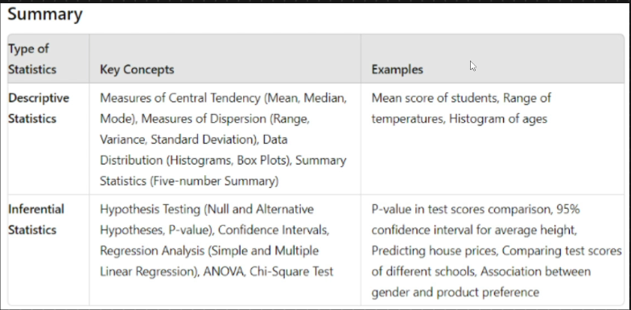

# Data - everything that is recorded , measured

# Statistics - Branch of maths that gives tools and techniques to ANALYS, CLEAR, VISULIZE data and MAKE PREDICTION

Insights from given data is descriptive statistics (basically analysing the data and finding patterns) - Using that patterns to predict is Inferential Statistics.

## Descriptive Statistics - Summarize ,Organizing, Analyz data - to get basic features of data.

### MCT - Measure of central tendency

#### Mean

#### Median

#### Mode

### MOD - Measure of Dispertion

#### Variance

#### Standard Deviation

### Data Distribution - Visulization

#### Histogram

#### Box plot

#### Pie chart

#### PD - Probability Distribution

### Summary Statistics

#### 5 Number summary

#### Quantiles

#### Q1

#### Q2

#### Q3

#### Q4

#### Min

#### Max

#### IQR

## Infrential Statistics - Prediction from data with diffrent methods and testings.

### Population - Whole data

Complete set of data - includes all the observations and parameters

Parameters - numerical values that describes some characteristics of population. (like : population mean )

Parameters summarize population - statistics summarize samples.

### Sample - Subset of whole data

Hypothesis testing

P Value

Confidence Interval

Statistics Analyst Test

Z-test

P-test

Anova Test

F-Test

Chi-Square
